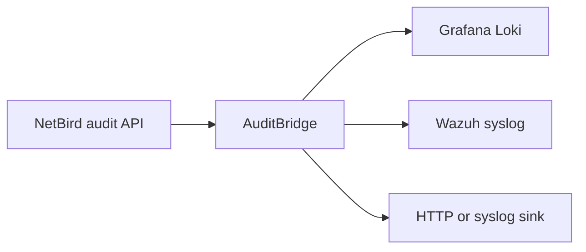
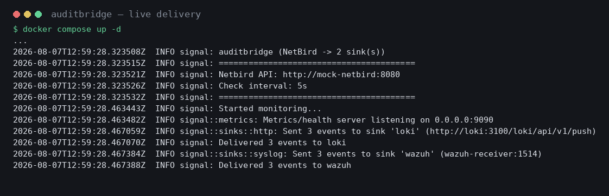
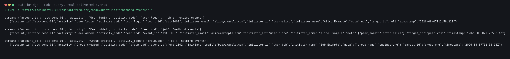
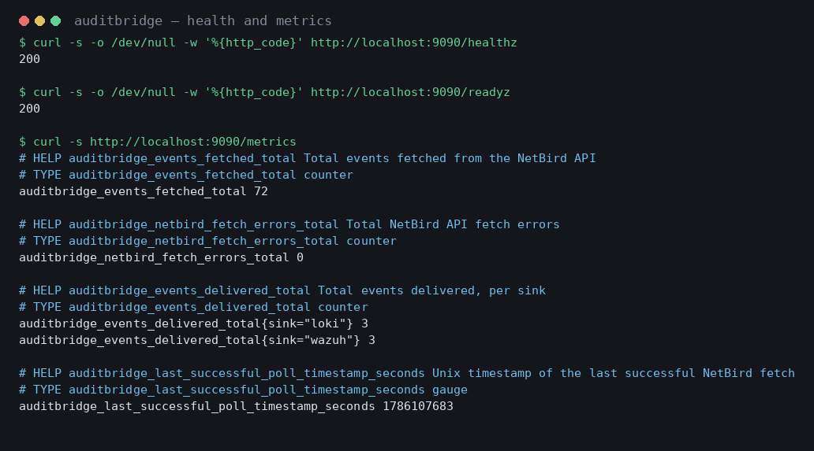

# AuditBridge

AuditBridge reads NetBird audit events and delivers them independently to Grafana
Loki, Wazuh, and generic HTTP or syslog destinations. It is a small Rust service
for security monitoring, compliance evidence, and incident response.



## Quick start

Get a NetBird access token (Team > create a Service User > create an access
token, see [Installation](docs/INSTALLATION.md#get-a-netbird-access-token) for
exact steps), store it in a file, then run a released immutable image:

```bash
echo "nbp_your_token_here" > netbird-token
chmod 600 netbird-token

docker run -d --rm --name auditbridge \
  -v "$PWD/netbird-token:/run/secrets/netbird-token:ro" \
  -e NETBIRD_API_TOKEN_FILE=/run/secrets/netbird-token \
  -e LOKI_URL=https://loki.example.com \
  -p 9090:9090 \
  ghcr.io/onelrian/auditbridge:<immutable-tag>
```

> [!WARNING]
> Replace `<immutable-tag>` with a released application version. Do not use
> `latest` in a production deployment, it moves whenever a new release ships.

Confirm it's running: `docker logs auditbridge` and `curl http://localhost:9090/healthz`.

## Documentation

| Need | Guide |
|---|---|
| Deploy with Docker, Compose, Kubernetes, or Helm | [Installation](docs/INSTALLATION.md) |
| Configure secrets, retries, cursors, and metrics | [Configuration](docs/CONFIGURATION.md) |
| Deliver to Loki, Wazuh, HTTP, or syslog | [Sinks](docs/SINKS.md) |
| Monitor and troubleshoot the service | [Operations](docs/OPERATIONS.md) |
| Develop and submit changes | [Contributing](CONTRIBUTING.md) |
| Report vulnerabilities | [Security](SECURITY.md) |
| Get help or report a defect | [Support](SUPPORT.md) |

## Health and metrics

AuditBridge serves `/healthz`, `/readyz`, and `/metrics` on `METRICS_PORT`
(default `9090`). Readiness requires a successful NetBird fetch and delivery to
at least one configured sink. See [Operations](docs/OPERATIONS.md) for metric
names and troubleshooting.

## Scaling limits

The NetBird audit endpoint returns the account's full audit history on every
poll and exposes no server-side paging or cursor parameters, so AuditBridge
compensates on the client side. A per-sink watermark persisted to
`CURSOR_FILE` filters out already-delivered events, and events that share a
timestamp with the watermark are tracked by ID so a later-arriving event with
an equal timestamp is neither dropped nor duplicated. Without a persisted
cursor, a restart replays the full history once, and a very large history is
still fetched and filtered in full each poll: this service suits audit volumes
that comfortably fit in memory. See [Configuration](docs/CONFIGURATION.md) for
the cursor behavior and [Operations](docs/OPERATIONS.md) for the symptoms it
produces.

## Verified

The screenshots below are real output from a live run: real Loki, a real
syslog receiver, and AuditBridge's actual binary, with only the upstream
NetBird API stubbed to fixed sample data (no live account involved).





> [!TIP]
> Don't take the screenshots' word for it: `examples/local-demo/` reproduces
> this exact setup with one `docker compose up`. See
> [examples/local-demo/README.md](examples/local-demo/README.md).

## License

Distributed under the MIT License. See [LICENSE](LICENSE).
