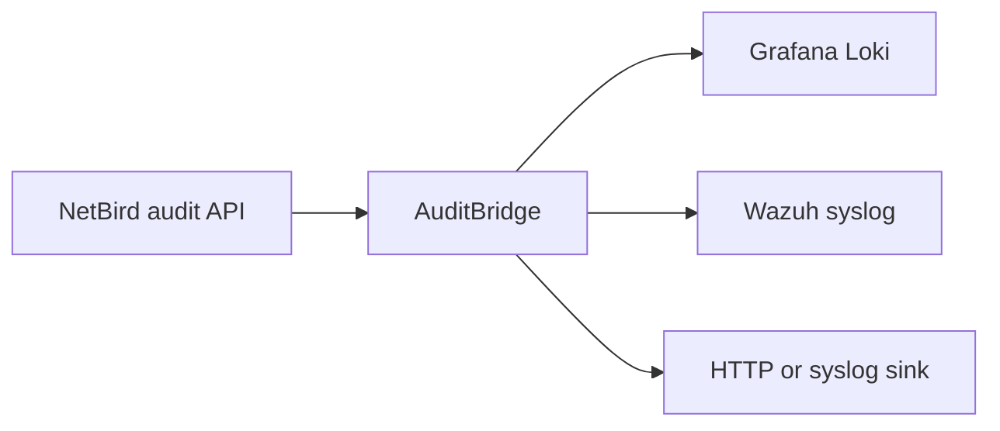

# AuditBridge

AuditBridge reads NetBird audit events and delivers them independently to Grafana
Loki, Wazuh, and generic HTTP or syslog destinations. It is a small Rust service
for security monitoring, compliance evidence, and incident response.



## Quick start

Create a NetBird personal access token with audit-log read access, store it in a
file, and run a released immutable image:

```bash
docker run --rm --name auditbridge \
  -v "$PWD/netbird-token:/run/secrets/netbird-token:ro" \
  -e NETBIRD_API_TOKEN_FILE=/run/secrets/netbird-token \
  -e LOKI_URL=https://loki.example.com \
  ghcr.io/onelrian/auditbridge:<immutable-tag>
```

Replace `<immutable-tag>` with a released application version. Do not use
`latest` for production deployments.

## Documentation

| Need | Guide |
|---|---|
| Deploy with Docker, Compose, Kubernetes, or Helm | [Installation](docs/INSTALLATION.md) |
| Configure secrets, retries, cursors, and metrics | [Configuration](docs/CONFIGURATION.md) |
| Deliver to Loki, Wazuh, HTTP, or syslog | [Sinks](docs/SINKS.md) |
| Monitor and troubleshoot the service | [Operations](docs/OPERATIONS.md) |
| Develop and submit changes | [Contributing](CONTRIBUTING.md) |
| Report vulnerabilities | [Security](SECURITY.md) |
| Get help or report a defect | [Support](SUPPORT.md) |

## Health and metrics

AuditBridge serves `/healthz`, `/readyz`, and `/metrics` on `METRICS_PORT`
(default `9090`). Readiness requires a successful NetBird fetch and delivery to
at least one configured sink. See [Operations](docs/OPERATIONS.md) for metric
names and troubleshooting.

## License

Distributed under the MIT License. See [LICENSE](LICENSE).
