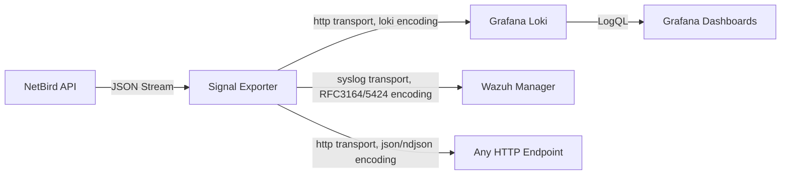

# Signal

[](https://github.com/onelrian/signal/actions)
[](https://hub.docker.com/r/onelrian/signal)
[](LICENSE)

Signal is a high-performance observability bridge for NetBird. It ingests audit events from the NetBird Management API and ships them to Grafana Loki, a Wazuh manager, and/or any generic HTTP endpoint, enabling real-time security monitoring, compliance auditing, and incident response.

## Features

- **Zero-Dependency Architecture**: Single binary or container; no local database or filesystem required.
- **Pluggable Sinks**: Ship the same event stream to Loki, Wazuh (syslog), and/or a generic HTTP endpoint at once, configured purely via environment variables.
- **Stateful Event Tracking**: Tracks an independent event cursor per sink, so one sink being down never blocks or duplicates delivery to the others.
- **Universal Compatibility**: Works seamlessly with both NetBird Cloud and Self-Hosted instances.
- **Production Hardened**: Written in Rust for minimal memory footprint and high reliability.

## Architecture

Signal acts as a stateless, highly available middleware between your NetBird control plane and your observability/SIEM stack.



Sinks are built from two generic primitives, not one Rust type per vendor:

- **Transport**: how bytes are delivered. `http` (any URL, method, headers) or `syslog` (TCP/UDP).
- **Encoding**: what the bytes look like. `json` (flat array), `ndjson`, `loki` (Loki's push API stream/label shape), `syslog3164`, or `syslog5424`.

Loki and Wazuh ship as named presets (`SINKS=loki,wazuh` works with zero further config), but any other backend that speaks plain HTTP or syslog, Datadog, Splunk HEC, a generic webhook, another SIEM, needs no new code, just a `SINK_<NAME>_*` block of environment variables. See [Adding a Custom Sink](#adding-a-custom-sink) below.

## Prerequisites

### Required

- **NetBird Personal Access Token (PAT)**: Admin-level token with audit log read permissions.
- **Grafana Loki**: A reachable Loki instance (configured for ingestion).
- **Network Access**: Outbound HTTPS to NetBird API and Loki endpoints.

### Recommended for Production

- **Secrets Management**: Docker Secrets and mounted Kubernetes Secret volumes are files, not env vars. Set `NETBIRD_API_TOKEN_FILE` (or `SINK_<NAME>_HEADERS_FILE` for a sink's bearer token/API key) to the mounted file's path instead of putting the value directly in `NETBIRD_API_TOKEN`/`SINK_<NAME>_HEADERS`, so it never shows up in `docker inspect` or a process listing. Setting both the direct var and its `_FILE` counterpart is an error, only one wins.
- **TLS**: Ensure `LOKI_URL` uses HTTPS if traversing public networks.

## Quick Start

### 1. Obtain NetBird PAT

1. Log in to your NetBird Dashboard.
2. Go to Users > Access Tokens.
3. Create a token and copy it (it is only shown once).

### 2. Deploy Signal

```bash
docker run -d --name signal \
  --restart unless-stopped \
  -e NETBIRD_API_URL="https://api.netbird.io/api" \
  -e NETBIRD_API_TOKEN="nbp_your_token_here" \
  -e LOKI_URL="http://<LOKI_URL>" \ # Replace with your Loki URL
  ghcr.io/onelrian/signal:latest
```
It will start a container named `signal` and run it in the background.

## Production Deployment

### Configuration Reference

Signal is configured entirely via environment variables.

| Variable | Description | Default | Required |
|----------|-------------|---------|----------|
| `NETBIRD_API_TOKEN` | NetBird PAT with audit permissions | - | **Yes**, unless `NETBIRD_API_TOKEN_FILE` is set |
| `NETBIRD_API_TOKEN_FILE` | Path to a file containing the PAT, for Docker/Kubernetes Secrets | - | No |
| `SINKS` | Comma-separated list of sink names to fan out to | `loki` | No |
| `NETBIRD_API_URL` | NetBird API base URL (for Self-Hosted) | `https://api.netbird.io` | No |
| `CHECK_INTERVAL` | Event polling interval (seconds) | `10` | No |
| `RUST_LOG` | Log level (`error`, `warn`, `info`, `debug`) | `info` | No |
| `RETRY_MAX_ATTEMPTS` | Max attempts per fetch/send before giving up for that cycle | `5` | No |
| `RETRY_BASE_DELAY_MS` | Backoff base delay (full jitter: random up to `base * 2^attempt`) | `500` | No |
| `RETRY_MAX_DELAY_MS` | Backoff delay cap | `30000` | No |

Both the NetBird fetch and every sink's send retry with backoff (independently per sink) before that cycle gives up on them, so a transient blip recovers without waiting for the next `CHECK_INTERVAL`.

#### Health and Metrics

| Variable | Description | Default |
|---|---|---|
| `METRICS_PORT` | Port for `/healthz`, `/readyz`, and `/metrics` | `9090` |

| Endpoint | Meaning |
|---|---|
| `GET /healthz` | Process is alive (always `200` once the server is up) |
| `GET /readyz` | `200` once the NetBird API has been reachable at least once and at least one sink has confirmed delivery, `503` otherwise (including if a later fetch starts failing again) |
| `GET /metrics` | Prometheus exposition format: `auditbridge_events_fetched_total`, `auditbridge_netbird_fetch_errors_total`, `auditbridge_events_delivered_total{sink}`, `auditbridge_delivery_errors_total{sink}`, `auditbridge_last_successful_poll_timestamp_seconds` |

#### Built-in sink presets

| Sink name | Variable | Description | Default |
|---|---|---|---|
| `loki` | `LOKI_URL` (or `SINK_LOKI_URL`) | Loki base URL (legacy var) or exact push URL | `http://loki:3100` |
| `wazuh` | `SINK_WAZUH_ADDR` (or `WAZUH_ADDR`) | Wazuh manager syslog address (`host:port`) | - (required if `wazuh` is in `SINKS`) |

#### Adding a Custom Sink

Any name in `SINKS` besides `loki`/`wazuh` is a fully generic sink, no code changes needed. Sink names become part of an environment variable name, so use only letters, digits, and underscores (no hyphens or spaces).

| Variable | Description |
|---|---|
| `SINK_<NAME>_TRANSPORT` | `http` or `syslog` |
| `SINK_<NAME>_ENCODING` | `json`, `ndjson`, `loki`, `syslog3164`, or `syslog5424` |
| `SINK_<NAME>_URL` | Destination URL (`http` transport) |
| `SINK_<NAME>_METHOD` | HTTP method, defaults to `POST` (`http` transport) |
| `SINK_<NAME>_HEADERS` | `Key1:Value1,Key2:Value2` (`http` transport, optional) |
| `SINK_<NAME>_HEADERS_FILE` | Path to a file containing the same `Key1:Value1,...` format, instead of `SINK_<NAME>_HEADERS` directly |
| `SINK_<NAME>_ADDR` | Destination `host:port` (`syslog` transport) |
| `SINK_<NAME>_PROTOCOL` | `tcp` or `udp`, defaults to `tcp` (`syslog` transport) |

Example, shipping to Loki and a generic JSON webhook at once:

```bash
docker run -d --name signal \
  -e NETBIRD_API_TOKEN="nbp_your_token_here" \
  -e SINKS="loki,my_webhook" \
  -e SINK_MY_WEBHOOK_TRANSPORT="http" \
  -e SINK_MY_WEBHOOK_URL="https://collector.example.com/ingest" \
  -e SINK_MY_WEBHOOK_ENCODING="json" \
  -e SINK_MY_WEBHOOK_HEADERS="Authorization:Bearer secret" \
  ghcr.io/onelrian/auditbridge:latest
```

#### Cursor Persistence

By default, each sink's delivery cursor lives only in memory: a restart re-fetches the account's full audit history and re-ships every event to every sink as if new. Set `CURSOR_FILE` to a path on a mounted persistent volume to resume from the last confirmed watermark instead.

| Variable | Description | Default |
|---|---|---|
| `CURSOR_FILE` | Path to a JSON file tracking each sink's last-delivered timestamp | unset (no persistence) |

This only helps if the path survives a restart, a bind mount in Docker, a PVC in Kubernetes. Without one, `CURSOR_FILE` just gets recreated empty every time the container restarts, which is harmless but pointless.

#### Scaling Limits

NetBird's `/api/events/audit` endpoint (confirmed against [docs.netbird.io/api/resources/events](https://docs.netbird.io/api/resources/events)) has no `page`, `page_size`, `since`, or cursor query parameters, unlike its newer `network-traffic` and `proxy` event endpoints. Every poll fetches the account's entire audit history in one response; there's no server-side way to ask NetBird for only events after a given point.

`CURSOR_FILE` (above) makes this tolerable across restarts by filtering client-side and only re-delivering events past each sink's last confirmed watermark, but it doesn't change what NetBird sends over the wire on every single poll. A long-lived, high-activity account will see fetch payload size and latency grow over time regardless of `CURSOR_FILE`. There's no tuning knob for this on this project's side; it's a NetBird API limitation.

### Docker Compose (Production)

```yaml
version: '3.8'

services:
  signal:
    image: ghcr.io/onelrian/signal:latest
    container_name: signal
    restart: unless-stopped
    
    # Security
    read_only: true
    security_opt:
      - no-new-privileges:true
    cap_drop:
      - ALL
    
    # Environment
    environment:
      - NETBIRD_API_TOKEN=${NETBIRD_PAT}
      - LOKI_URL=http://loki:3100
      - CHECK_INTERVAL=30
      - RUST_LOG=info
      - CURSOR_FILE=/data/cursor.json

    # Cursor persistence: without this volume, CURSOR_FILE still works but
    # resets on every restart (read_only above still allows writes here,
    # since it's a mounted volume, not the container's root filesystem).
    volumes:
      - signal-cursor:/data

    # Dependencies
    depends_on:
      - loki
    
    # Network
    networks:
      - monitoring

networks:
  monitoring:
    driver: bridge

volumes:
  signal-cursor:
```

### Kubernetes Deployment

Use a simple Deployment and Secret.

```yaml
apiVersion: apps/v1
kind: Deployment
metadata:
  name: signal
spec:
  replicas: 1
  selector:
    matchLabels:
      app: signal
  template:
    metadata:
      labels:
        app: signal
    spec:
      containers:
      - name: signal
        image: ghcr.io/onelrian/signal:latest
        env:
        - name: LOKI_URL
          value: "http://loki.monitoring.svc:3100"
        - name: NETBIRD_API_TOKEN
          valueFrom:
            secretKeyRef:
              name: netbird-secrets
              key: api-token
        - name: CURSOR_FILE
          value: "/data/cursor.json"
        volumeMounts:
        - name: cursor
          mountPath: /data
      volumes:
      - name: cursor
        persistentVolumeClaim:
          claimName: signal-cursor
---
apiVersion: v1
kind: PersistentVolumeClaim
metadata:
  name: signal-cursor
spec:
  accessModes: ["ReadWriteOnce"]
  resources:
    requests:
      storage: 1Mi
```

A `PersistentVolumeClaim` is required here. `emptyDir` only survives in-place container restarts, not pod rescheduling, so it doesn't actually solve the problem this section exists for.


## Monitoring & Observability

Signal enriches every event with structured metadata for querying.

### Log Labels

| Label | Description | Example |
|---|---|---|
| `job` | Component identifier | `netbird-events` |
| `activity` | Human-readable event name | `Group created` |
| `activity_code` | Machine-readable event code | `group.add` |
| `account_id` | Tenant/Account ID | `w89s7...` |
| `initiator_email` | Actor who triggered the event | `admin@example.com` |


## License

Distributed under the MIT License. See [LICENSE](LICENSE) for more information.
