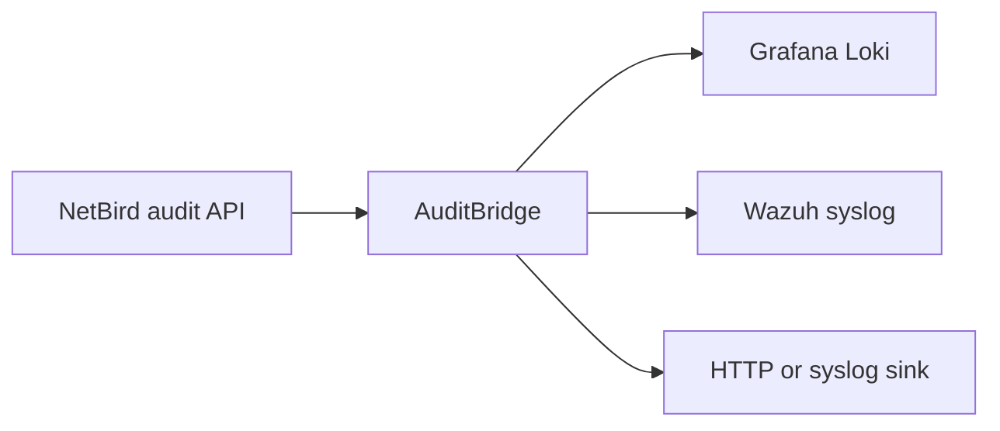

# AuditBridge

AuditBridge reads NetBird audit events and delivers them independently to Grafana
Loki, Wazuh, and generic HTTP or syslog destinations. It is a small Rust service
for security monitoring, compliance evidence, and incident response.



## Quick start

Get a NetBird access token (Team > create a Service User > create an access
token, see [Installation](docs/INSTALLATION.md#get-a-netbird-access-token) for
exact steps), store it in a file, then run a released immutable image:

```bash
echo "nbp_your_token_here" > netbird-token
chmod 600 netbird-token

docker run -d --rm --name auditbridge \
  -v "$PWD/netbird-token:/run/secrets/netbird-token:ro" \
  -e NETBIRD_API_TOKEN_FILE=/run/secrets/netbird-token \
  -e LOKI_URL=https://loki.example.com \
  -p 9090:9090 \
  ghcr.io/onelrian/auditbridge:<immutable-tag>
```

> [!WARNING]
> Replace `<immutable-tag>` with a released application version. Do not use
> `latest` in a production deployment, it moves whenever a new release ships.

Confirm it's running: `docker logs auditbridge` and `curl http://localhost:9090/healthz`.

## Documentation

| Need | Guide |
|---|---|
| Deploy with Docker, Compose, Kubernetes, or Helm | [Installation](docs/INSTALLATION.md) |
| Configure secrets, retries, cursors, and metrics | [Configuration](docs/CONFIGURATION.md) |
| Deliver to Loki, Wazuh, HTTP, or syslog | [Sinks](docs/SINKS.md) |
| Monitor and troubleshoot the service | [Operations](docs/OPERATIONS.md) |
| Develop and submit changes | [Contributing](CONTRIBUTING.md) |
| Report vulnerabilities | [Security](SECURITY.md) |
| Get help or report a defect | [Support](SUPPORT.md) |

## Health and metrics

AuditBridge serves `/healthz`, `/readyz`, and `/metrics` on `METRICS_PORT`
(default `9090`). Readiness requires a successful NetBird fetch and delivery to
at least one configured sink. See [Operations](docs/OPERATIONS.md) for metric
names and troubleshooting.

## Verified

Every sink type is verified end to end in [examples/local-demo](examples/local-demo/README.md):
real Loki, real TCP and UDP syslog receivers, a real HTTP webhook receiver, and
AuditBridge's actual binary — only the NetBird API is stubbed to fixed sample
data, no live account involved. The evidence below is real output captured from
that compose stack, reproduced with one `docker compose up -d --build`.

| Sink | Delivery | Captured evidence |
|---|---|---|
| Grafana Loki | `SINKS=loki` | Loki query response, one stream per activity, nanosecond timestamps |
| Wazuh | `SINKS=wazuh`, `SINK_WAZUH_ADDR` | RFC 3164 frames received over TCP |
| Generic HTTP | `SINK_<NAME>_TRANSPORT=http` | `application/x-ndjson` `POST /ingest` received at the webhook |
| Generic syslog | `SINK_<NAME>_TRANSPORT=syslog` | RFC 5424 frames received over UDP |

Each section in [Sinks](docs/SINKS.md) pairs the complete configuration with
its verification commands and the captured output, including readyz/metrics
showing per-sink delivered totals.

> [!TIP]
> Don't take this page's word for it: `examples/local-demo/` reproduces the
exact setup with one command, and every block above is re-capturable from its
logs and endpoints. See [examples/local-demo/README.md](examples/local-demo/README.md).

## License

Distributed under the MIT License. See [LICENSE](LICENSE).
