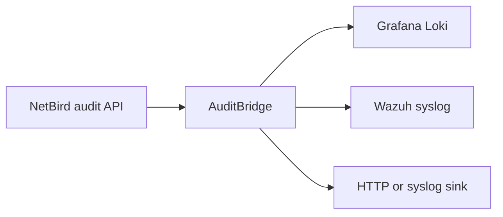

# AuditBridge

AuditBridge reads NetBird audit events and delivers them independently to Grafana
Loki, Wazuh, and generic HTTP or syslog destinations. It is a small Rust service
for security monitoring, compliance evidence, and incident response.



## Quick start

Get a NetBird access token (Team > create a Service User > create an access
token, see [Installation](docs/INSTALLATION.md#get-a-netbird-access-token) for
exact steps), store it in a file, then run a released immutable image:

```bash
echo "nbp_your_token_here" > netbird-token
chmod 600 netbird-token

docker run -d --rm --name auditbridge \
  -v "$PWD/netbird-token:/run/secrets/netbird-token:ro" \
  -e NETBIRD_API_TOKEN_FILE=/run/secrets/netbird-token \
  -e LOKI_URL=https://loki.example.com \
  -p 9090:9090 \
  ghcr.io/onelrian/auditbridge:<immutable-tag>
```

> [!WARNING]
> Replace `<immutable-tag>` with a released application version. Do not use
> `latest` in a production deployment, it moves whenever a new release ships.

Confirm it's running: `docker logs auditbridge` and `curl http://localhost:9090/healthz`.

## Documentation

| Need | Guide |
|---|---|
| Deploy with Docker, Compose, Kubernetes, or Helm | [Installation](docs/INSTALLATION.md) |
| Configure secrets, retries, cursors, and metrics | [Configuration](docs/CONFIGURATION.md) |
| Deliver to Loki, Wazuh, HTTP, or syslog | [Sinks](docs/SINKS.md) |
| Monitor and troubleshoot the service | [Operations](docs/OPERATIONS.md) |
| Develop and submit changes | [Contributing](CONTRIBUTING.md) |
| Report vulnerabilities | [Security](SECURITY.md) |
| Get help or report a defect | [Support](SUPPORT.md) |

## Health and metrics

AuditBridge serves `/healthz`, `/readyz`, and `/metrics` on `METRICS_PORT`
(default `9090`). Readiness requires a successful NetBird fetch and delivery to
at least one configured sink. See [Operations](docs/OPERATIONS.md) for metric
names and troubleshooting.

## Verified

Every sink type the project supports is verified against a receiver.
The evidence below is from a live run of
AuditBridge's actual binary against a real NetBird account and real receivers;
`examples/local-demo/` reproduces the same setup with one `docker compose up`
against a stubbed NetBird API.

**Loki / Grafana**: events delivered and queried back via LogQL:

```json
{"status":"success","data":{"resultType":"streams","result":[{"stream":{"account_id":"acc-demo-01","activity":"Peer added","activity_code":"peer.add","job":"netbird-events","service_name":"netbird-events"},"values":[["1786619000000000000","{\"account_id\":\"acc-demo-01\",\"activity\":\"Peer added\",\"activity_code\":\"peer.add\",\"event_id\":\"evt-1001\",\"initiator_email\":\"alice@example.com\",\"initiator_name\":\"Alice Example\",\"meta\":{\"peer_name\":\"laptop-alice\"},\"target_id\":\"peer-7f3a\",\"timestamp\":\"2026-08-13T11:32:35Z\"}"]]}]}}
```

**Wazuh**: an event received, decoded by the `netbird-audit` decoder, and
fired rule `108650`:

```json
{"timestamp":"2026-08-13T11:02:48.532+0000","rule":{"level":3,"description":"NetBird audit: user login by desmondtardzenyuy@gmail.com","id":"108650","firedtimes":1,"groups":["netbird_audit","authentication_success"]},"agent":{"id":"000","name":"wazuh-wazuh-helm-manager-worker-0"},"manager":{"name":"wazuh-wazuh-helm-manager-worker-0"},"id":"1786618968.606","full_log":"2026-08-13T11:02:46.437457Z auditbridge netbird-audit: {\"account_id\":null,\"activity\":\"Dashboard login\",\"activity_code\":\"dashboard.login\",\"event_id\":\"36802451\",\"initiator_email\":\"desmondtardzenyuy@gmail.com\",\"initiator_name\":\"Tardzenyuy Desmond\",\"target_id\":\"google-oauth2|110002193708859160832\",\"timestamp\":\"2026-08-13T11:02:46.437457Z\"}","predecoder":{"program_name":"netbird-audit","timestamp":"2026-08-13T11:02:46.437457Z aud"},"decoder":{"name":"netbird-audit"},"data":{"account_id":"null","activity":"Dashboard login","activity_code":"dashboard.login","event_id":"36802451","initiator_email":"desmondtardzenyuy@gmail.com","initiator_name":"Tardzenyuy Desmond","target_id":"google-oauth2|110002193708859160832","timestamp":"2026-08-13T11:02:46.437457Z"},"location":"10.42.0.27"}
```

**Generic HTTP**: 57 events delivered as NDJSON to a webhook receiver:

```
Sent 57 events to sink 'webhook' (http://127.0.0.1:8081/ingest)
[http-receiver] /ingest ct=application/x-ndjson
{"id":"25185791","timestamp":"2026-05-22T16:04:15.645176Z","activity":"Account created","activity_code":"account.create","initiator_email":"desmondtardzenyuy@gmail.com","initiator_name":"Tardzenyuy Desmond","target_id":"d887svqfadhs73fem8rg","account_id":null,"meta":{}}
```

**Generic syslog**: RFC 5424 over TCP and RFC 3164 over UDP:

```
Sent 57 events to sink 'syslogtcp' (127.0.0.1:1514)
<134>1 2026-05-22T16:04:15.645176Z auditbridge netbird-audit - AUDIT - {"account_id":null,"activity":"Account created","activity_code":"account.create","event_id":"25185791","initiator_email":"desmondtardzenyuy@gmail.com","initiator_name":"Tardzenyuy Desmond","meta":{},"target_id":"d887svqfadhs73fem8rg","timestamp":"2026-05-22T16:04:15.645176Z"}

Sent 57 events to sink 'syslogudp' (127.0.0.1:1515)
<134>2026-05-22T16:04:15.645176Z auditbridge netbird-audit: {"account_id":null,"activity":"Account created","activity_code":"account.create","event_id":"25185791","initiator_email":"desmondtardzenyuy@gmail.com","initiator_name":"Tardzenyuy Desmond","meta":{},"target_id":"d887svqfadhs73fem8rg","timestamp":"2026-05-22T16:04:15.645176Z"}
```

> [!TIP]
> Don't take this output's word for it: `examples/local-demo/` reproduces the
> whole matrix with one `docker compose up`. See
> [examples/local-demo/README.md](examples/local-demo/README.md).

## License

Distributed under the MIT License. See [LICENSE](LICENSE).
