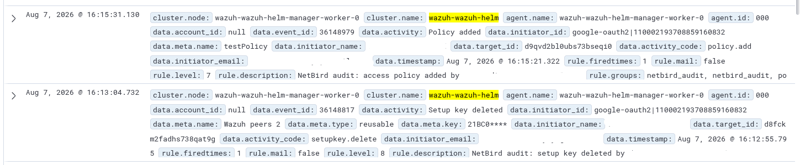

# Sinks

Set `SINKS` to a comma-separated list. Each sink maintains its own cursor, so
a failing destination does not block successful deliveries to another one.

## Loki

`loki` is enabled by default. Set `LOKI_URL` to a Loki base URL or use
`SINK_LOKI_URL` for an exact push URL.

## Wazuh

Add `wazuh` to `SINKS` and set `SINK_WAZUH_ADDR` or `WAZUH_ADDR` to the Wazuh
manager `host:port`. The default syslog encoding is RFC3164.

The Wazuh manager's syslog listener is commonly configured for **UDP** (for
example `<protocol>udp</protocol>` on port `11514`). AuditBridge defaults to
TCP, so set `SINK_WAZUH_PROTOCOL=udp` to match a UDP listener:

```bash
docker run -d --rm --name auditbridge \
  -e NETBIRD_API_TOKEN_FILE=/run/secrets/netbird-token \
  -e SINKS=wazuh \
  -e SINK_WAZUH_ADDR=wazuh-manager:11514 \
  -e SINK_WAZUH_PROTOCOL=udp \
  ghcr.io/onelrian/auditbridge:<immutable-tag>
```

### Wazuh-side setup

AuditBridge ships each event as a syslog message with `program_name:
netbird-audit` and a JSON body. To decode and alert on these events, add a
decoder and ruleset to the Wazuh manager:

- **Decoder** — match the `netbird-audit` program and parse the JSON body
  (for example via `JSON_Decoder`), exposing fields such as `activity`,
  `activity_code`, `initiator_email`, `initiator_name`, `target_id` and
  `meta.*`.
- **Rules** — a base rule that fires on every `netbird-audit` event, plus
  higher-severity rules for sensitive activities (access-token and setup-key
  changes, user/peer/group management, policy/route/network changes, and
  failed logins).

### Example



## Generic sinks

For every other sink name, use these variables with `<NAME>` converted to upper
case and underscores:

| Variable | Required for | Values |
|---|---|---|
| `SINK_<NAME>_TRANSPORT` | every generic sink | `http` or `syslog` |
| `SINK_<NAME>_ENCODING` | every generic sink | `json`, `ndjson`, `loki`, `syslog3164`, or `syslog5424` |
| `SINK_<NAME>_URL` | HTTP | Destination URL |
| `SINK_<NAME>_METHOD` | HTTP | HTTP method, default `POST` |
| `SINK_<NAME>_HEADERS` | HTTP | Comma-separated `Name:Value` headers |
| `SINK_<NAME>_HEADERS_FILE` | HTTP | File containing headers instead of the direct variable |
| `SINK_<NAME>_ADDR` | syslog | Destination `host:port` |
| `SINK_<NAME>_PROTOCOL` | syslog | `tcp` or `udp`, default `tcp` |

> [!TIP]
> Use the `_HEADERS_FILE` form for bearer tokens and API keys, mounted from a
> Docker or Kubernetes secret, instead of `SINK_<NAME>_HEADERS` directly.

### Worked example: a generic HTTP webhook

Deliver to Loki and a custom webhook at the same time, naming the second sink
`webhook` (any name works, it becomes the `SINK_<NAME>_*` prefix and the
`sink` label in its own metrics):

```bash
docker run -d --rm --name auditbridge \
  -v "$PWD/netbird-token:/run/secrets/netbird-token:ro" \
  -e NETBIRD_API_TOKEN_FILE=/run/secrets/netbird-token \
  -e SINKS=loki,webhook \
  -e LOKI_URL=https://loki.example.com \
  -e SINK_WEBHOOK_TRANSPORT=http \
  -e SINK_WEBHOOK_URL=https://collector.example.com/ingest \
  -e SINK_WEBHOOK_ENCODING=json \
  -e SINK_WEBHOOK_HEADERS="Authorization:Bearer your-webhook-token" \
  ghcr.io/onelrian/auditbridge:<immutable-tag>
```

The same pattern applies to any generic sink, HTTP or syslog.
[examples/local-demo](../examples/local-demo/) exercises `loki` and `wazuh`
together against real receivers; the `webhook` example above follows the same
shape for a generic HTTP destination instead.
